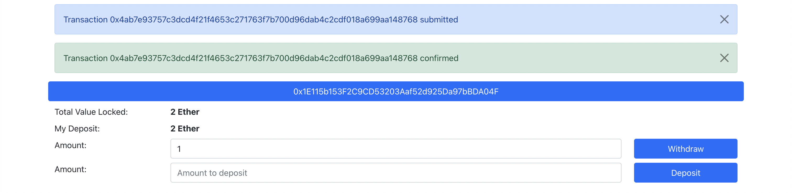

# DApp
Simple Smart Contract hosted on the Ethereum Ropsten Testnet that provides deposit and withdraw functionality. 
To use the Smart Contract, the user simply connects his MetaMask wallet to the frontend.

## How to use
1. Make sure you have the [MetMask Chrome Extension](https://chrome.google.com/webstore/detail/metamask/nkbihfbeogaeaoehlefnkodbefgpgknn) installed 
2. Go to MetaMask settings and make sure Testnets are not hidden
3. Switch to the Ropsten Testnet
4. Go to [MetaMask Ether Faucet](https://faucet.metamask.io/), connect your wallet and request some test ether 
5. Go to [the frontend](https://smart-contract-test.netlify.app/) and test the Smart Contract
6. Now you can interact with the Smart Contract by sending some ether and withdrawing it afterwards

